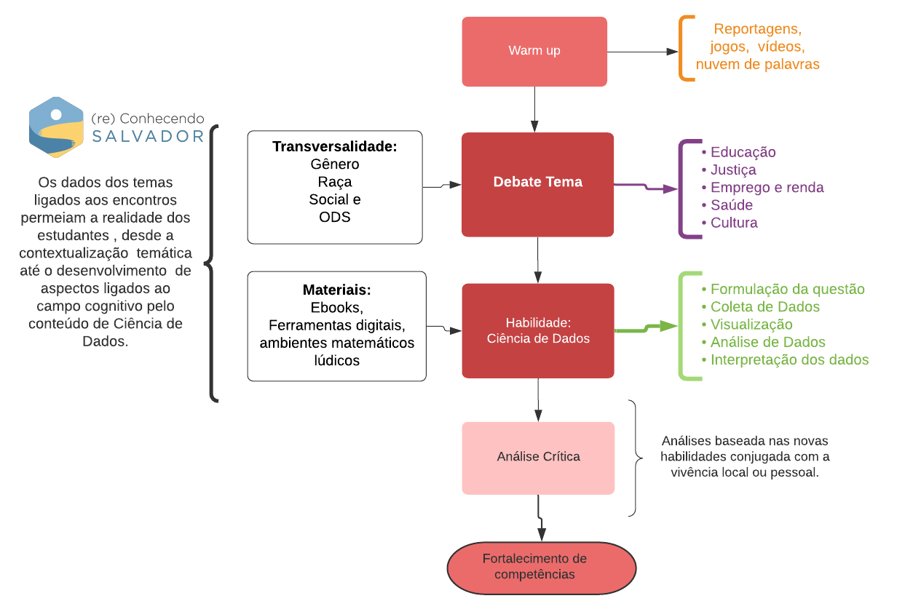

# Relatório - Ciência de Dados {#cap2}


## Introdução

A disciplina de introdução à ciência de dados 
é constituída de um propósito transformador, 
aproximar estudantes e escola do universo 
dos dados de maneira a se apropriar dos principais 
dados, sistemas de informação e tomada de decisões 
no contexto local de um grupo de discentes, 
docentes, comunidade escolar e de bairro. 

Coordenada por uma equipe da universidade e operada 
num contexto à distância, neste relatório são reveladas 
 as principais estratégias 
e **insights** resultado da promoção do encontro destes 
vários atores. Esta disciplina não é uma ilha, 
em paralelo a sua execução são realizadas 
atividades de protagonismo racial, social e de gênero, 
práticas investigativas e inteligência artificial. 
Estes temas tão atuais, tangenciam os propósitos 
das ciências de dados,  funcionando como um mecanismo
de cooperação. Uma rede 
de colaboradores palestrantes também 
enriqueceram o repertório de todos os atores que 
participaram do projeto, tornando a
execução da discipliana de ciência de dados uma atividade 
punjante e transformadora do contexto social ao 
qual pertencem estes jovens cientistas.

Nas  seções a seguir são destacadas as principais experiências 
vivenciadas com os estudantes participantes 
do projeto Ciência de Dados na Educação Pública 
no contexto desta disciplina. Foram 
realizados com os Jovens Cientistas (JC) 
11 encontros dedicados apenas para ciência de dados. 
Parte desses encontros é resultado da proposição de 
um tema em 2 dias diferentes, sendo o restante 
constituída apenas de um encontro, contudo 
guiado por retornos via whatsapp.  


## Metodologia 

Os encontros com os estudantes foram realizados de forma online e
síncrona. As atividades foram realizadas de maneira que favorecessem
o diálogo entre os participantes. Com o objetivo de desenvolvimento de 
habilidades ligadas a ciência de dados, como a formulação de perguntas 
e hipóteses sobre um determinado tema, coleta e organização de dados,
representação matemática por gráficos e outras visualizações de dados e
por fim aplicações de elementos matemáticos e estatísticos para síntese 
de informações que conduzem tomada de decisão entralaçamos temas chave   
 como educação, saúde, população, transportes etc. Aliado a esta abordagem
 sempre foram atingindos os temas transversais ligados justiça 
 social, racial e de gênero por meio de uma estratégias que envolviam 
 dados desagregados. Todo este cenário promove a emergência das 
 questões ligadas às humanidades digitais, como o amplo debate 
 gerado pelo viéses estatísticos. Nas seções a seguir são 
 apresentados os relatos dos encontros que dão detalhes 
 destas experiências.
 



## Tabela resumo de habilidades dos encontros

Nesta seção resumimos  principais conceitos, habilidades e 
temas avaliados ao longo deste ano. Permitindo que 
seja alcançada uma ideia destes encontros num único olhar.

```{r quadrohab, echo=FALSE, message=FALSE, warning=FALSE}
library(dplyr)
library(kableExtra)

variaveis <- c("Ações", "Descrição", "Habilidades", 
               "Competências", "Metodologia","Dificuldades", "Avanços")

acoes <- c(
  "Introdução à Ciência de dados",
  "Coleta de dados",
  "Visualização de dados",
  "Correlação e Causalidade",
  "Indicadores de tendência central - Média e Mediana", 
  "Pesquisa Amostral",
  "Introdução à probabilidade"
)
  
#  "Ebook Ciência de Dados",
#  "Materiais auxiliares",
#  "Site reconhecendo Salvador"
#)

subtema <- c(
  "Sistemas de recomendações",
  "Programas de assistência social e distribuição de renda",
  "Exame Nacional do Ensino Médio",
  "Capoeira e dados de futebol",
  "Indicadores criminais",
  "Sistema de transporte público e violência contra mulher",
  "Pesquisa Nacional da Saúde do Escolar (PeNSE)")


habilidades <- c(
  "Compreensão do funcionamento das tecnologias de digitais baseada em ciências
  de dados.",
  "Compreensão dos sistemas de coleta de dados e informações ligados aos principais programas de assistência social e redistribuição de renda.",
  "Identificação de fatores correlacionados ao desempenho no ENEM por meio
  de visualização de dados.", 
  "Desenvolvimento de pensamento matemático e estatístico por 
  meio do diálogo sobre manifestações culturais como capoeira. E 
  de conceitos de causalidade e 
  correlação por meio de análise de dados de futebol", 
  "Análise crítica de indicadores criminais suportado em 
  visualização de dados e desenvolvimento da capacidade de síntese
  por meio de estatísticas.", 
  "Desenvolvimento de habilidades ligadas a formulação de hipóteses, 
  planejamento e execução de pesquisas amostrais e compreensão 
  da mobilidade e segurança da mulher.", 
  "Representação e aquisição de vocabulários ligados a probabilidade 
  promovendo a habilidade de transposição de conhecimento para diversas 
  áreas. Debate ligado a saúde do estudantes por meio da pesquisa PeNSE IBGE."
)

cod_bncc <- c(
              "EMIFCG01",
              "EMIFMAT07 e EMIFMAT08",
              "EMIFMAT07", 
              "EMIFMAT05 e EMIFMAT06", 
              "EMIFCG07", 
              "EMIFCG02 e EMIFCNT02",
              "EMIFMAT03 e EMIFMAT06"
              )

#descricao <- c(
#  "Encontro online síncrono com os estudantes do projeto",
#  "Aprimoramento e escrita de novos capítulos do ebook de Ciência de Dados",
#  "Desenvolvimento de dashboards e apps online em linguagem R.",
#  "Desenvolvimento do site reconhecendo Salvador. Coleta, organização e 
#povoamento de dados. Definição de boas práticas e procedimentos de gestão de 
#  dados."
#)

quadro <- data.frame(acoes,subtema,cod_bncc,habilidades)

names(quadro) <- c("Encontros","Tema", "Cód. Habilidade","Descrição")

kbl(quadro,caption = "Descrição das atividades realizadas pelo 
    equipe de Ciência de Dados.")

```


## Dicussão e conclusão 


O principal estrato do material dos relatos dos encontros 
de ciências de dados constitui-se dos pilares 
sobre os quais este projeto se baseou para sua realização. 
Os estudantes buscam a todo momento caminhos para dialogar 
sobre suas experiências, sendo elas as mais profundas 
quanto a desigualdade social. Muito embora 
isto seja verdade, esse também é o elemento 
que os posicionam num local de autoridade para tratar 
destes problemas. Incluímos na nossa pequena trajetória 
com estes incríveis jovens, informações a respeito 
de sistemas de redistribuição de renda  e auxílio 
social, violência contra mulher no Estado da Bahia e a
perda de mobilidade urbana em Salvador e indicadores de 
segurança com recortes de gênero e raça/cor. 
Em resumo, eles reconhecem estes temas
pelo lado em que os dados não revelam com tanto clareza,
trazendo uma forte base argumentativa. Por outra lado, 
a Ciência de Dados dá um caminho diferente, para acessar 
outras visões sobre estes assuntos. Esta ponte 
é ainda mais reforçada quando trazemos para os encontros 
 experiências culturais que são ainda mais 
íntimas a estes estudantes, como a capoeira ou o debate 
sobre o que são os seus alimentos, seus hábitos e sua 
saúde. Este entralace entre desigualdade social, 
escancaradamente revelado nas justificativas
de faltas dos estudantes participantes do projeto,  
 emergem aquilo que é de conhecimento tácito, 
 a maioria dos jovens de Salvador não estão incluídos 
 de forma qualificada numa sociedade digitalizada.
 Também foi alvo de observação do projeto 
 a necessidade que os estudantes tiveram 
 de gerenciar o tempo devido ao  retorno as aulas 
 online e depois presencial. Alguns 
 relataram como o volume de atividades 
 começaram a intereferir na sua ampla 
 capacidade de participar de todas as 
 atividades. 
Os avanços observados na argumentação de alguns 
estudantes ao longo dos encontros, revelados 
na frequente utilização de vocábulos da área, 
contrasta com o que tipicamente se observa 
nos principais indicadores da educação brasileira
a respeito dos avanços em disciplinas ligadas a 
área de exatas. 
Embora dados recentes revelem o crescimento do IDEB,  
por exemplo, os índices das escolas participantes 
estão aquém do que se espera para que o jovem 
alcance os elementos idealizados como uma boa educação.  
Por todo o contexto complexo da realização das atividades
durante a pandemia, aliado às dificuldades relatadas pelos 
estudantes, a frequente participação e a exitosa realização 
das avaliações do projeto demonstram que é possível 
alcançar resultados neste tecido de interface entre os diversos 
atores. Num momento da história que a tecnologia digital 
tem que ser planejado para evitar mais um braço de desigualdade,
atividades como esta são exemplos  que devem ser 
ampliadas para um número maior de estudantes. 

