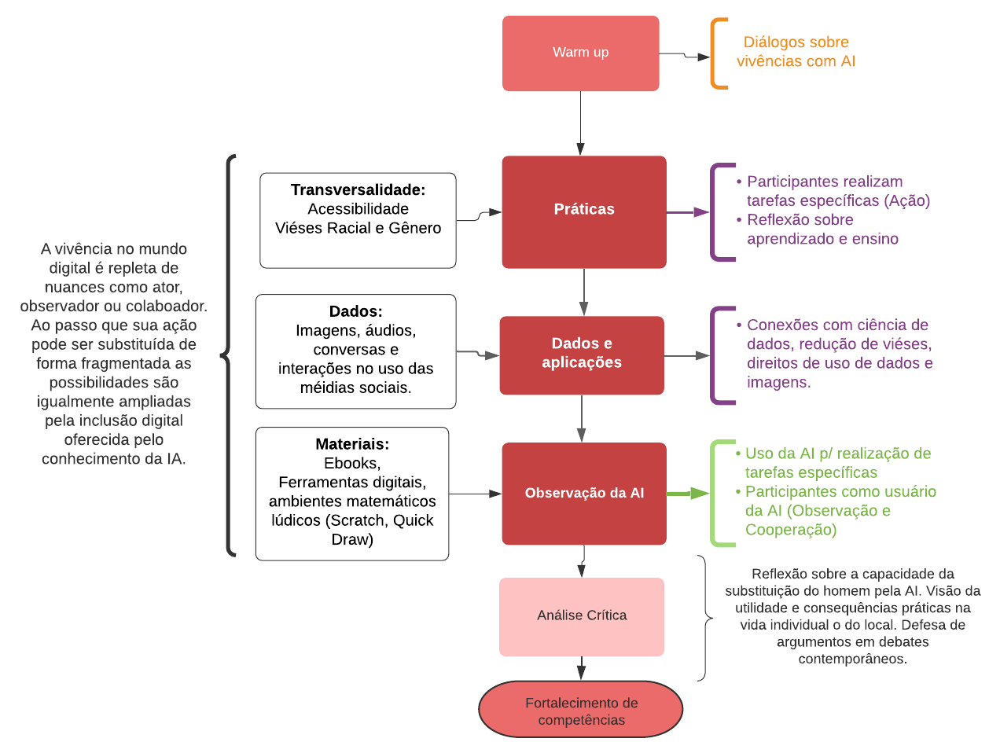

# Relatório de Inteligência Artificial {#cap3}


## Introdução 

A disciplina "Inteligência artificial, a divertida mente das máquinas" imerge no universo da 
inteligência artificial através da experimentação e interação com ferramentas gratuitas e de fácil 
acesso. Sendo assim, o ensino-aprendizagem é conduzido de maneira lúdica com a confecção e interação 
com jogos e algoritmos baseados nos conceitos de inteligência artificial presentes nos dias atuais. 
Para tanto, propõe-se a estimulação do senso crítico e investigativo dos alunos através da proposição 
de soluções para problemas da escola e comunidade local com o auxílio da inteligência artificial, 
permitindo um contato direto com sua realidade e desmistificando a complexidade das tecnologias 
envolvidas nessa área. 


## Metodologia

A disciplina de inteligência artificial é constituída de aspectos peculiares, 
que tornam a sua elaboração tão mais eficaz quanto mais
for capaz de posicionar o estudante como aprendiz, 
similar às etapas de calibração do modelo de inteligência artificial. 
Portanto, a estratégia consiste no uso de práticas, atividades e 
debates nos quais cada participante atua, realiza tarefas específicas 
ligadas ao uso de tecnologias. Em seguida, é promovido um debate mediado 
pelo instrutor buscando um consenso e o respeito pelas diferentes formas de 
desenvolvimento das atividades. Estabelecida a natureza estatística
das perspectivas de aprendizado, são experimentados  recursos digitais 
baseados em modelos de AI que simulam comportamentos humanos, 
como uma conversa, capacidade de reconhecimento de desenhos ou mesmo
a escrita de textos (como os casos de *fake news*). Nesta
etapa o estudante é substituído por uma inteligência  artificial, 
então é colocado na posição de observador, gestor 
ou num sistema cooperação. Desta relação são estimulados 
aos debates tão atuais entorno dos aspectos éticos e práticos dessas 
aplicações. Sendo enriquecido pela 
plena inteface com os métodos de preparação dos bancos de 
dados (tema mais intensamente trabalhado em Ciência de Dados) 
utilizados pelas IAs bem como os aspectos modernos 
das redes sociais e suas conexões com sistema de recomendações. 
Nas dinâmicas  de retorno dos encontros, 
são realizadas atividades que desenvolvem habilidades 
específicas ao universo de linguagem, aprendizado e
inteligência artificial por meio de ferramentas
LOGO. 




## Tabela de Habilidades e Competências 

Nesta seção resumimos  principais conceitos, habilidades e 
temas avaliados ao longo deste ano. Permitindo que 
seja alcançada uma ideia destes encontros num único olhar.

```{r quadroai, echo=FALSE, message=FALSE, warning=FALSE}
library(dplyr)
library(kableExtra)

variaveis <- c("Ações", "Descrição", "Habilidades", 
               "Competências", "Metodologia","Dificuldades", "Avanços")

acoes <- c(
  "Introdução a inteligência artificial",
  "Inteligência Artificial e produção de informações",
  "Inteligência Artificial no apoio a tomada de decisão",
  "Aplicação da inteligência artificial em sistemas dinâmicosa")
  
  

subtema <- c(
  "Emprego e População",
  "Educação e Família",
  "Saúde",
  "Transporte e mobilidade")
  
descricao <- c(
  "Compreensão da estrutura geral da inteligência artificial, por meio de ferramentas 
  interativas e debate sobre a mudança da sociedade quanto emprego",  
  "Capacidade de qualificar dados de aprendizado de máquina e julgar a qualidade das aplicações, 
  uso da internet, produção de notícias falsas (*fake News*) e aplicações em Scratch",
  "Uso de IA no apoio de classificação  nível de emergência e tomada de decisão, utilização de ferramenta online de diagnóstico e indicação de emergência. Teste de hipóteses e verificação do uso 
  por sintomas padrão de doenças",
  "Entendimento da aplicação da AI em sistemas dinâmicos com informações em tempo real. Debate sobre o uso de carros autonômos, debate sobre Big Data e aspectos tecnológicos dos sensores utilizados em veículos autônomos.")
  
cod_bncc <- c(
              "EMIFMAT01",
              "EMIFCNT01",
              "EMIFCNT02",
              "EMIFCNT03")


quadroai <- data.frame(acoes,subtema,cod_bncc,descricao)

names(quadroai) <- c("Encontros","Tema", "Cód. Habilidade","Descrição")

kbl(quadroai,caption = "Descrição das atividades realizadas pelo 
    equipe de Ciência de Dados.")

```


## Discussão e Conclusão


Por se tratar de uma disciplina eletiva, ligado ao campo do tecnológico 
e de  intensa exploração do universo dos quadrinhos,
pela indústria dos desenhos animados e cinema,
a inteligência artificial tem sido desde os seus primórdios veiculada, 
alcançando os mais diversos grupos, portanto, sendo um tema familiar aos estudantes. 
O que torna mediação dos conteúdos de inteligência artificial bem mais 
abastecido de análogos lúdicos. Igualmente é a produção intensa 
de materiais que simulam experiências na *internet* ou mesmo 
nos *smartphones*,  que permitem que os estudantes cheguem aos 
encontros de maneira mais aberta e estimulados para compreensão do seu funcionamento.
Em diversas situações nos encontros, os estudantes foram capazes de sair dos experimentos 
e tarefas simples e generalizar o pensamento para situações extremas, 
por fim sendo realizado um consenso, no qual as diferentes opiniões 
regulavam o papel da inteligência na sociedade. Os encontros 
tiverem momentos que alternavam os papeis dos estudantes como 
atores, aqueles que realizam atividades e como usuários  da inteligência
artificial. Promovendo um balanço entre treinamento ou calibração de inteligências, 
ou uso destas ferramentas, entendo dos esforços, benefícios e fragilidades dos seus 
usos. Os estudantes dos dois grupos tiveram uma boa experiência nesta disciplina 
e foram estimulados a entrar no universo destas aplicações de maneira mais 
ativa pela programação de IA utilizando linguagem LOGO (Scracth). Avançando nesta
trajetória, experimentaram o uso de ferramentas ligadas a saúde para 
diagnósticos de emergência, inclusive fizeram a verificação da ferramenta 
por meio de testes com sintomas padrão de algumas doenças. Demonstranto 
que poderiam fazer a conexão os elementos de ciência de dados. 
Os conceitos de inteligência artificial forte e fraca também foi amplamente 
debatido, demonstrando que eles podem ser futuros cientistas no aprimoramento 
de tais ferramentas, ainda que seja deslumbrante as tarefas que elas já realizam. 
Portanto, consolidando a ideia de que capacidade de fazer analogias ou 
transpor um conhecimento é da inteligência humana. Não obstante, 
tais avanços são contrapostos quando a sociedade é exposta às "fake news",
demonstrando que robôs "inteligentes" podem produzir argumentos que confundem
por exemplo usuários de redes sociais, ainda que sejam oriundos de uma IA fraca.
Há um grande potencial didático e pedagógico do conhecimento ligado 
ao da inteligência artificial. Em STEAM ela tem interfaces que permeiam 
desde os campos mais técnicos até àqueles ligados a filosofia dos paradigmas  de 
aprendizagem. Outro fator motivador é sua plena presença na sociedade, o que 
deixa de ser apenas uma escolha de plano de ensino para tratar de questões de
uma sociedade moderna. 


